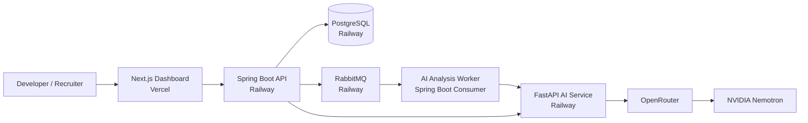
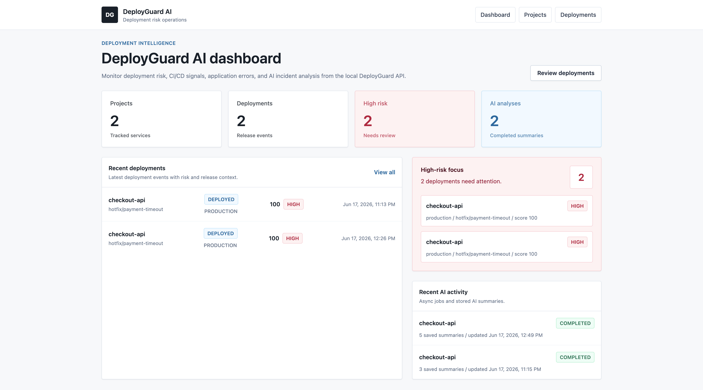
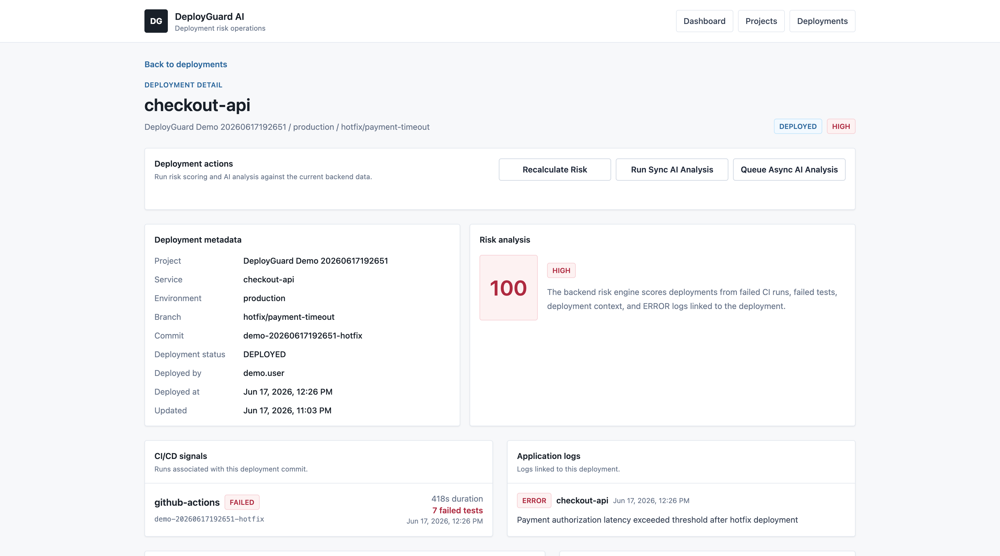
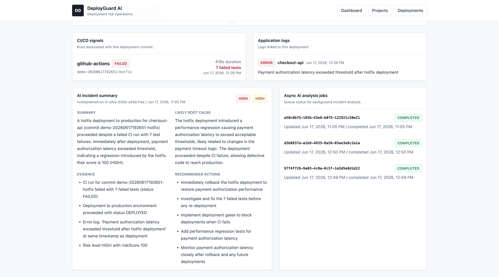

# DeployGuard AI

**AI-powered deployment risk detection and incident analysis for modern DevOps teams.**

DeployGuard AI correlates deployments, CI/CD runs, and application logs to detect risky releases before they become incidents. It combines a deterministic risk-scoring engine with an AI incident-analysis service, a RabbitMQ async workflow, and a Next.js dashboard.

## Live Demo

| Service | URL |
| --- | --- |
| Frontend dashboard | https://deployguard-ai-coral.vercel.app/ |
| Backend API | https://deployguard-api-production.up.railway.app |
| AI service | https://deployguard-ai-production.up.railway.app |

> The hosted demo is a portfolio deployment, not a production SaaS environment. Authentication, multi-tenancy, distributed tracing, and retry/DLQ behavior are not implemented yet.

## Recruiter Quick Links

- [Interview guide](docs/interview-guide.md) — short walkthroughs, design rationale, trade-offs, and likely questions.
- [Resume bullets](docs/resume-bullets.md) — concise and detailed resume-ready project bullets.
- [System design](docs/system-design.md) — architecture diagrams, data model, reliability behavior, and scaling notes.
- [Deployment guide](docs/deployment.md) — Railway/Vercel deployment configuration and container build notes.
- [E2E demo validation](docs/e2e-demo-validation.md) — local validation script and expected checks.

## Problem

Deployment incidents are hard to triage quickly because the useful signals are scattered:

- CI failures live in one system.
- Deployment metadata lives somewhere else.
- Error logs are separate from the deployed commit.
- Incident summaries often require manual investigation under pressure.

DeployGuard AI creates a single workflow for answering: **what changed, how risky is it, what evidence supports that risk, and what should the team do next?**

## Solution Overview

DeployGuard AI models projects, deployments, CI runs, and application logs in PostgreSQL. The Spring Boot backend computes an explainable deployment risk score from deterministic rules, then sends the same deployment context to a FastAPI AI service for structured incident analysis. AI analysis can run synchronously or asynchronously through RabbitMQ jobs.

The AI service integrates with OpenRouter/NVIDIA Nemotron when an API key is configured. If the model call fails, times out, returns invalid JSON, or no API key exists, the service returns a deterministic fallback response with the same schema.

## Key Features

- **Deployment risk scoring:** deterministic score from failed CI, failed tests, ERROR logs, hotfix branches, and production deploys.
- **Incident context model:** projects, deployments, CI/CD runs, application logs, AI summaries, and async jobs stored in PostgreSQL.
- **Synchronous AI analysis:** immediate incident summary with root cause, evidence, recommended actions, severity, and confidence.
- **Asynchronous AI jobs:** RabbitMQ-backed queue with `PENDING`, `PROCESSING`, `COMPLETED`, and `FAILED` job states.
- **Safe AI fallback:** valid response returned even when OpenRouter is unavailable or unconfigured.
- **Next.js dashboard:** project list, deployment list, deployment detail view, risk badges, AI summaries, and job status.
- **Demo automation:** seed script and validation script create and verify realistic demo data.
- **Hosted portfolio deployment:** frontend on Vercel; backend, AI service, PostgreSQL, and RabbitMQ on Railway.

## Architecture Overview



Detailed diagrams are in [docs/system-design.md](docs/system-design.md).

## Tech Stack

| Layer | Technology | Purpose |
| --- | --- | --- |
| Frontend | Next.js 15, React 19, TypeScript, Tailwind CSS | Dashboard and deployment detail UI |
| Backend | Spring Boot 3.5, Java 21, Maven | REST APIs, risk scoring, orchestration, async worker |
| AI service | FastAPI, Python 3.12, Pydantic, httpx | OpenRouter/Nemotron call and fallback incident analysis |
| Database | PostgreSQL 16 | Projects, deployments, CI runs, logs, summaries, jobs |
| Migrations | Flyway | Versioned database schema changes |
| Queue | RabbitMQ | Async AI analysis job processing |
| Local infra | Docker Compose | PostgreSQL and RabbitMQ for local development |
| Hosting | Railway, Vercel | Hosted demo deployment |

## System Workflow

1. A project is created with a repository URL and service name.
2. A deployment is recorded with commit SHA, branch, environment, status, and deployer.
3. CI/CD run data is ingested for the project and commit.
4. Application logs are ingested and optionally linked to the deployment.
5. The backend recalculates risk from deterministic rules.
6. The frontend displays the deployment, risk score, CI signals, logs, AI summaries, and job history.

## AI Analysis Workflow

### Synchronous

1. Client calls `POST /api/deployments/{deploymentId}/ai-analysis`.
2. Backend loads deployment, project, CI runs, and logs.
3. Backend calls the FastAPI AI service.
4. AI service calls OpenRouter/Nemotron or returns fallback.
5. Backend stores the AI incident summary and returns it.

### Asynchronous

1. Client calls `POST /api/deployments/{deploymentId}/ai-analysis/jobs`.
2. Backend creates an `ai_analysis_jobs` row with `PENDING` status.
3. Backend publishes a RabbitMQ message.
4. Spring Boot worker marks the job `PROCESSING`.
5. Worker calls the same AI analysis flow.
6. Worker stores the summary and marks the job `COMPLETED`, or stores an error and marks it `FAILED`.
7. Client polls `GET /api/ai-analysis/jobs/{jobId}`.

## Screenshots

Screenshots are expected under `docs/screenshots/`. Add captured images there when preparing the final portfolio walkthrough.







See [docs/screenshot-checklist.md](docs/screenshot-checklist.md) for the recommended capture list.

## Local Setup

### Prerequisites

- Java 21
- Maven
- Python 3.12
- Node.js and npm
- Docker Desktop
- curl

### 1. Start infrastructure

```bash
docker compose -f infra/docker-compose.yml up -d postgres rabbitmq
```

### 2. Start the AI service

```bash
cd ai-service
python3.12 -m venv .venv
source .venv/bin/activate
pip install -r requirements.txt
python -m uvicorn app.main:app --host 127.0.0.1 --port 8001
```

### 3. Start the backend

```bash
cd backend/deployguard-api
DB_HOST=localhost \
DB_PORT=5432 \
DB_NAME=deployguard \
DB_USERNAME=deployguard \
DB_PASSWORD=deployguard \
AI_SERVICE_BASE_URL=http://localhost:8001 \
RABBITMQ_HOST=localhost \
RABBITMQ_PORT=5672 \
RABBITMQ_USERNAME=deployguard \
RABBITMQ_PASSWORD=deployguard \
mvn spring-boot:run
```

### 4. Start the frontend

```bash
cd frontend
npm install
NEXT_PUBLIC_API_BASE_URL=http://localhost:8080 npm run dev
```

Open http://localhost:3000.

Full setup and troubleshooting: [docs/local-development.md](docs/local-development.md).

## Environment Variables

| Service | Variable | Local example | Notes |
| --- | --- | --- | --- |
| Backend | `DB_HOST` | `localhost` | PostgreSQL host |
| Backend | `DB_PORT` | `5432` | PostgreSQL port |
| Backend | `DB_NAME` | `deployguard` | Database name |
| Backend | `DB_USERNAME` | `deployguard` | Local Docker username |
| Backend | `DB_PASSWORD` | `deployguard` | Local-only password; use hosted secrets outside local dev |
| Backend | `AI_SERVICE_BASE_URL` | `http://localhost:8001` | FastAPI service URL |
| Backend | `RABBITMQ_HOST` | `localhost` | RabbitMQ host |
| Backend | `RABBITMQ_PORT` | `5672` | RabbitMQ AMQP port |
| Backend | `RABBITMQ_USERNAME` | `deployguard` | Local Docker username |
| Backend | `RABBITMQ_PASSWORD` | `deployguard` | Local-only password; use hosted secrets outside local dev |
| Backend | `FRONTEND_ALLOWED_ORIGINS` | `http://localhost:3000` | CORS allow-list |
| AI service | `OPENROUTER_API_KEY` | empty | Secret; never commit a real key |
| AI service | `OPENROUTER_MODEL` | `nvidia/nemotron-3-ultra-550b-a55b:free` | Confirm availability in OpenRouter |
| AI service | `OPENROUTER_BASE_URL` | `https://openrouter.ai/api/v1` | OpenRouter API base URL |
| AI service | `OPENROUTER_TIMEOUT_SECONDS` | `30` | Model request timeout |
| Frontend | `NEXT_PUBLIC_API_BASE_URL` | `http://localhost:8080` | Public browser value; not a secret |

More detail: [docs/configuration.md](docs/configuration.md).

## Seed Demo Data

After the backend, AI service, frontend, PostgreSQL, and RabbitMQ are running:

```bash
./scripts/seed-demo.sh
```

The script creates:

- one project
- one high-risk production deployment
- one failed CI run
- one `ERROR` application log
- a recalculated risk score
- one queued async AI analysis job

Override the backend URL if needed:

```bash
BACKEND_URL=http://localhost:8080 ./scripts/seed-demo.sh
```

## Validation and Smoke Tests

Run the complete local demo validation:

```bash
./scripts/validate-demo.sh
```

Run the AI service smoke test:

```bash
./scripts/smoke-test-ai.sh
```

Run component checks:

```bash
# Backend
cd backend/deployguard-api
mvn test

# AI service
cd ai-service
python -m pytest

# Frontend
cd frontend
npm run build
```

## Deployment Architecture

- **Vercel:** hosts the Next.js frontend.
- **Railway:** hosts the Spring Boot backend, FastAPI AI service, PostgreSQL, and RabbitMQ.
- **OpenRouter:** provides model access for NVIDIA Nemotron incident summaries.
- **Fallback mode:** keeps AI analysis operational when a model key is missing or a model call fails.

Deployment configuration details are in [docs/deployment.md](docs/deployment.md). Do not commit platform tokens, database credentials, RabbitMQ credentials, or OpenRouter keys.

## System Design Concepts Demonstrated

- Monorepo organization across backend, AI service, frontend, infra, scripts, and docs
- REST API design with validation and structured error responses
- Relational data modeling for deployment, CI, log, AI summary, and job entities
- Flyway schema migration discipline
- Deterministic scoring separate from probabilistic AI output
- Async job processing with RabbitMQ and a tracked job lifecycle
- Graceful degradation when external AI providers fail
- CORS configuration for hosted frontend/backend separation
- Dockerized services and local reproducibility
- Deployment split across Vercel and Railway

## Resume Bullet Examples

- Built **DeployGuard AI**, a production-style DevOps platform using Spring Boot, FastAPI, Next.js, PostgreSQL, and RabbitMQ to correlate deployment, CI/CD, and log signals into explainable deployment risk scores.
- Designed synchronous and asynchronous AI incident-analysis workflows with OpenRouter/NVIDIA Nemotron integration, deterministic fallback behavior, and persisted AI summary history.
- Implemented a RabbitMQ-backed job pipeline for AI analysis with `PENDING`, `PROCESSING`, `COMPLETED`, and `FAILED` states, decoupling model latency from API requests.
- Deployed a full-stack portfolio demo with Vercel frontend hosting and Railway backend, AI service, PostgreSQL, and RabbitMQ infrastructure.

More examples: [docs/resume-bullets.md](docs/resume-bullets.md).

## Repository Structure

```text
deployguard-ai/
  backend/deployguard-api/   Spring Boot API, risk engine, AI orchestration
  ai-service/                FastAPI OpenRouter/Nemotron analysis service
  frontend/                  Next.js dashboard
  infra/                     Docker Compose for local infrastructure
  scripts/                   Demo seed, AI smoke test, E2E validation
  docs/                      Architecture, deployment, runbooks, recruiter docs
```

## Known Limitations

- No authentication or authorization yet
- No multi-tenancy yet
- Hosted demo exists, but there is no production-grade SaaS deployment
- No distributed tracing yet
- No retry or dead-letter queue behavior for failed async jobs
- Observability is limited to logs and health checks
- Redis caching is planned but not implemented

## Security Notes

- No API keys or secrets are committed.
- `.env` files are ignored and should stay local.
- Local Docker Compose credentials are development-only.
- OpenRouter keys belong in a local `.env` file or hosted secret manager.

See [docs/security-notes.md](docs/security-notes.md).
