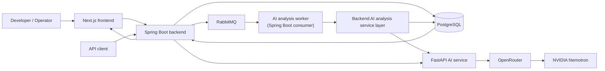
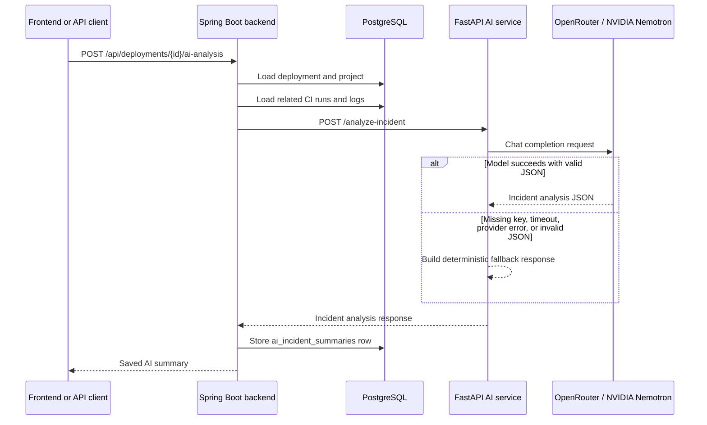
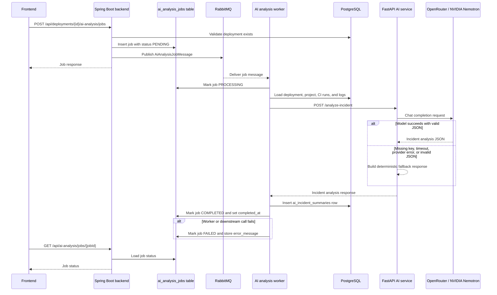

# System Design

DeployGuard AI is a deployment risk and incident analysis platform. The current local system combines a Next.js dashboard, Spring Boot API, PostgreSQL database, RabbitMQ queue, FastAPI AI service, and OpenRouter-backed NVIDIA Nemotron analysis with deterministic fallback behavior.

## High-Level Architecture

## Synchronous AI Analysis

The synchronous endpoint is useful when a caller wants the AI summary immediately and can tolerate waiting for the model call or fallback response.

## Asynchronous AI Analysis

The asynchronous path returns a job immediately and processes model analysis through RabbitMQ. It is better for longer-running analysis and future scaling.

## Data Model Overview

`projects`
: Represents an application or service tracked by DeployGuard. A project stores the display name, GitHub repository URL, service name, and timestamps.

`deployments`
: Represents a deployed commit for a project. A deployment stores commit SHA, branch, environment, status, deployer, deployment time, risk score, risk level, and timestamps.

`ci_runs`
: Represents CI/CD results for a project and commit. A CI run stores provider, status, duration, failed test count, and creation time.

`application_logs`
: Represents ingested application log events. Logs are linked to a project and can optionally be linked to a deployment. They store service name, level, message, log timestamp, and creation time.

`ai_incident_summaries`
: Stores AI incident analysis results for a deployment. Evidence and recommended actions are stored as JSON text for now.

`ai_analysis_jobs`
: Tracks asynchronous AI analysis work. Jobs store deployment, status, error message, creation/update timestamps, and completion time.

## Major Components

Frontend
: The Next.js app provides the local dashboard, project list, deployment list, deployment detail pages, and UI actions for risk recalculation and AI analysis.

Backend
: The Spring Boot API owns core domain data, validation, Flyway migrations, risk scoring, synchronous AI analysis orchestration, and asynchronous job creation/worker processing.

AI service
: The FastAPI service accepts deployment, CI, log, and risk context. It calls OpenRouter when configured and returns the same response schema with fallback behavior when model calls fail.

Database
: PostgreSQL stores projects, deployments, CI runs, logs, AI summaries, and async job state. Flyway manages schema migrations.

Message broker
: RabbitMQ decouples async AI analysis job creation from worker processing.

External model provider
: OpenRouter routes model requests to the configured NVIDIA Nemotron model. Model identifiers, quotas, and free-tier availability can change.

## Technology Choices

Spring Boot
: A strong fit for the backend because it provides mature REST APIs, validation, dependency injection, JPA integration, Flyway support, and RabbitMQ integration.

FastAPI
: A good fit for the AI service because Python is common for model-facing services, and FastAPI gives lightweight request validation and simple JSON APIs.

PostgreSQL
: Provides reliable relational storage, UUID support, timestamp types, and enough structure for deployment, CI, log, job, and summary relationships.

Flyway
: Keeps database schema changes explicit, ordered, and repeatable across local and CI environments.

RabbitMQ
: Provides a straightforward queue for async AI analysis work without introducing heavier event-streaming infrastructure.

Next.js
: Provides a TypeScript frontend with routing, local development ergonomics, and a simple path toward richer dashboard screens.

OpenRouter / NVIDIA Nemotron
: OpenRouter gives a provider-facing API for model calls, while Nemotron is used for incident-analysis style summarization when configured.

## Reliability Behavior

- The AI service returns a deterministic fallback response when `OPENROUTER_API_KEY` is missing, OpenRouter fails, a request times out, or the model returns invalid JSON.
- AI service failures do not crash the backend. Synchronous backend analysis returns a clear error when the AI service is unavailable.
- Asynchronous worker failures mark jobs as `FAILED` and store an error message.
- Synchronous analysis is simpler for immediate responses, but it ties the client request to downstream AI latency.
- Asynchronous analysis returns quickly and is more scalable, but clients must poll job status and read summaries later.

## Scaling Considerations

- Multiple RabbitMQ consumers can process AI jobs concurrently when the workload grows.
- Queue depth can provide backpressure when OpenRouter or the AI service is slow.
- Database indexes will become important for common lookups such as deployments by project, CI runs by project/commit, logs by deployment, and jobs by deployment.
- Backend instances are intended to be stateless aside from database and RabbitMQ dependencies, which supports horizontal scaling.
- OpenRouter rate limits and model provider quotas should be treated as first-class capacity limits.
- Caching may help for repeated dashboard reads, repeated summary lookups, or expensive derived metrics. Redis is not currently implemented.

## Known Limitations

- No authentication is implemented.
- No multi-tenancy is implemented.
- No distributed tracing is implemented.
- No production deployment is configured yet.
- No retry or dead-letter queue behavior is documented as implemented.
- Observability is limited to local logs and basic health checks.
- Evidence and recommended actions are stored as JSON text rather than first-class relational structures.

## Future Roadmap

- Authentication and authorization
- Multi-tenant organizations
- GitHub webhook ingestion
- CI/CD provider integrations
- Retry and dead-letter queues for failed async jobs
- Distributed tracing and richer metrics
- Hosted deployment
- Production-grade secrets management
- More robust search, filtering, and indexing for logs and deployment history
